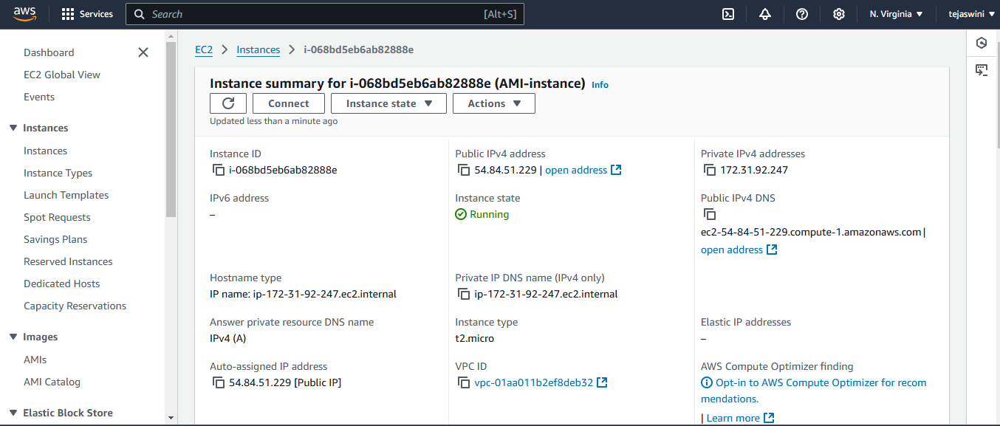
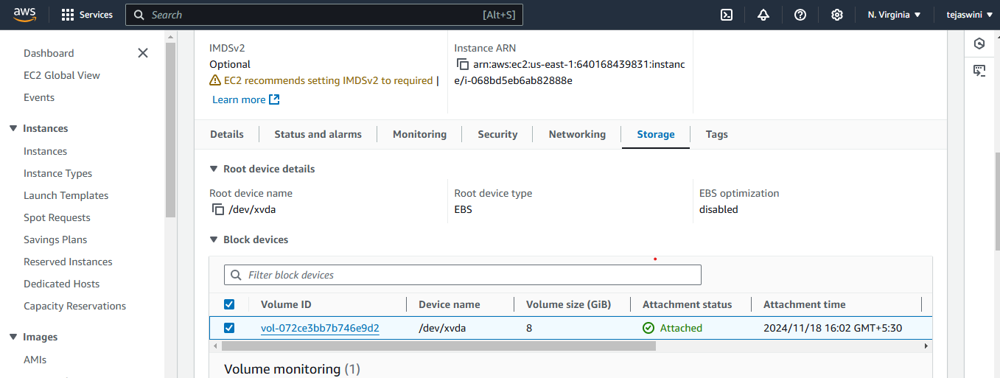
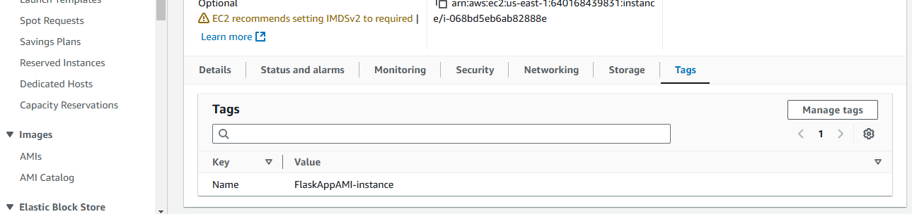
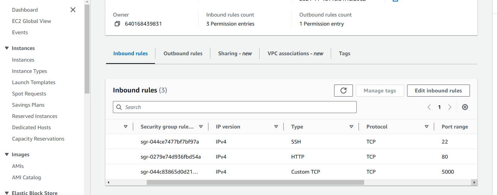

Log in to the AWS Management Console and navigate to the EC2 dashboard.

2.Launch an Instance:
   - Click on "Launch Instance."
   - Choose the Amazon Linux 2 AMI.
   - Select an instance type (t2.micro
   ).
   - Click "Next: Configure Instance Details."
   

3.Configure Instance Details:
   - Leave default settings or customize as needed.
   - Click "Next: Add Storage."

4.Configure Storage:
   - Default settings are usually fine (8 GiB).
   - Click "Next: Add Tags."
   

5.Add Tags (Optional):
   - Add any tags for organization, e.g., Key: `Name`, Value: `FlaskAppInstance`.
   - Click "Next: Configure Security Group."
   

6.Configure Security Group:
   - Create a new security group.
   - Add the following rules:
     - Type: 'SSH', Protocol: 'TCP', Port Range: '22', Source: 'Your IP' (for SSH access).
     - Type: 'HTTP', Protocol: 'TCP', Port Range: '80', Source: 'Anywhere' (for web access).
     - Type: 'Custom TCP', Protocol: 'TCP', Port Range: '5000', Source: 'Anywhere' (for Flask app access).
   - Click "Review and Launch."
   

7.Review and Launch:
   - Review your configurations and click "Launch."
   - Choose or create a key pair for SSH access, and download it.

Step 2: SSH into Your EC2 Instance

1. **Connect via SSH:**
   ```bash
   ssh -i "dev.pem" root@ec2-54-84-51-229.compute-1.amazonaws.com
   ```

 Step 3: Install Required Packages

1.Update the Package Repository:
   sudo yum update -y
   

2.Install Python 3 and pip:
   sudo yum install -y python3


3.Install Flask:
pip3 install Flask

Step 4: Develop the Flask Application

1.Create a New Directory for Your Application:
   mkdir flask-app
   cd flask-app
   

2.Create the Flask App:
   - Create a file named `app.py`:
   
   from flask import Flask
   from datetime import datetime

   app = Flask(__name__)

   @app.route('/')
   def home():
       current_time = datetime.now().strftime("%Y-%m-%d %H:%M:%S")
       return f"<h1>Current Server Time</h1><p>{current_time}</p>"

   if __name__ == '__main__':
       app.run(host='0.0.0.0', port=5000)
   ```

Step 5: Run the Application

1.Start the Flask Application:
   python3 app.py
   

2.Access Your Application:
   - Open a web browser and navigate to `http://your-instance-public-dns:5000`.
   - You should see the current server time displayed.
   

Step 6: Create a Custom AMI

1.Stop the EC2 Instance:
   - Go back to the EC2 console and select your instance.
   - Click on "Instance State" and then "Stop."

2.Create an AMI:
   - Right-click on your stopped instance, select "Image," and then "Create Image."
   - Name it (e.g., `FlaskAppAMI`), and fill in any details.
   - Click "Create Image."

   

3.Launch New Instances from Your AMI:
   - You can now launch new EC2 instances using this custom AMI, which includes your pre-configured Flask application.
   
