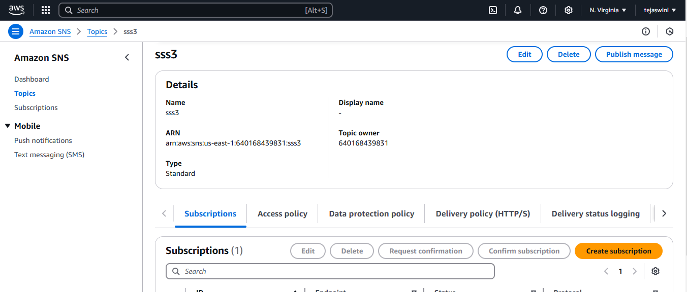

1. Create an S3 Bucket with Appropriate Naming and Versioning

   ** Log in to AWS Console **

      Navigate to the S3 service.

       Create a New Bucket 

       Click Create bucket.

    Enter the bucket name as 
    multimedia-storage-ibmbucket-bucket ibmbucket

      Select your preferred region.

      Enable Bucket Versioning

  ## In the bucket  scrolldown BucketVersioning ##

    Choose Enable.

    Upload Files

    Open the created bucket 

   ** Click Upload and select files with the same name multiple times **

    
    Verify versions by selecting the file and clicking Versions.

2. Organize Files Using (Folders)

   Create Folders

   Open the bucket.

   ** Click Create folder for each of the following **

       images/

       videos/

       documents/.

       Upload Files to Folders

       Open each folder and upload files.

3. Implement Lifecycle Policies for Cost Optimization

        *** Go to Management Tab ***

    Open the bucket, go to the Management tab, and click Create lifecycle rule.

       Set Lifecycle Rules

       Rule 1: For the images/ folder:

       Name the rule: Images-Lifecycle.

    Action: 
    
        Move objects to S3 Standard-IA after 30 days.

    Rule 2:

        For the videos/ folder:

    Name the rule: 
      
        Videos-Lifecycle.

   Action:

         Move objects to S3 Glacier after 60 days.

         Delete objects after 180 days.

         Click Save.

4. Enable Server-Side Encryption

        *** Navigate to Properties Tab ***

    Open the bucket and go to the Properties tab.

    Enable Encryption

    Scroll to Default encryption and click Edit.

    Choose one of the following:

    SSE-S3: Managed by S3 with no additional configuration.

    SSE-KMS: Use AWS KMS-managed keys.

    Save Changes

5. Configure Access Controls and Bucket Policies

        *** Create a Bucket Policy ***

   Go to the Permissions tab, and under Bucket Policy, click Edit.

   Add a JSON policy granting read access to a specific IAM user/role:

json
{
    "Version": "2012-10-17",
    "Statement": [
        {
            "Effect": "Allow",
            "Principal": {
                "AWS": "arn:aws:iam::640168439831:role/mys3role"
            },
            "Action": "s3:GetObject",
            "Resource": "arn:aws:s3:::ibmbuckt/*"
        }
    ]
}

## Apply ACLs ##

    Go to Access Control List (ACL).

    Grant specific users/groups read/write permissions.

    Block Public Access

    Ensure Block Public Access is enabled to avoid unintended exposure.

    Test and Verify Permissions

6. Set Up S3 Event Notifications for File Management Automation

        *** Enable Event Notifications ***

   Open the bucket, go to the Properties tab, and scroll to Event notifications.

   Click Create event notification.

   Define Event Types

    Name the event: 
  
                 File-Created-Notification.

    Choose event type:

                   s3:ObjectCreated

    Select SNS Topic or configure email notifications.

    Test Notifications

## Upload and delete files to trigger notifications ##

    Verify the email or SNS topic receives notifications.

