Step 1: Set up the VPC (Virtual Private Cloud)

    ## Create a VPC with a /16 CIDR block ##

1) Go to the VPC Dashboard in AWS Management Console.
 
     Click Create VPC and assign a CIDR block of   10.0.0.0/16 

     Choose an appropriate name for the VPC.

     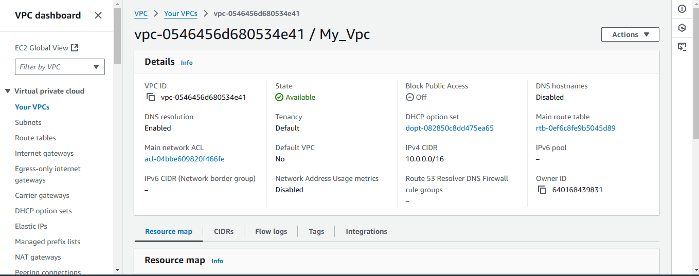

2) Create subnets within the VPC:

     Public Subnet with 4,096 IP addresses:

     CIDR Block: 10.0.0.0/20 (This gives you 4,096 IPs).

     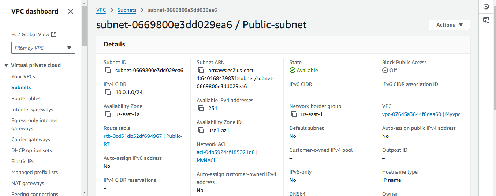

     Private Subnet with 256 IP addresses:

     CIDR Block: 10.0.16.0/24 (This gives you 256 IPs).
   
     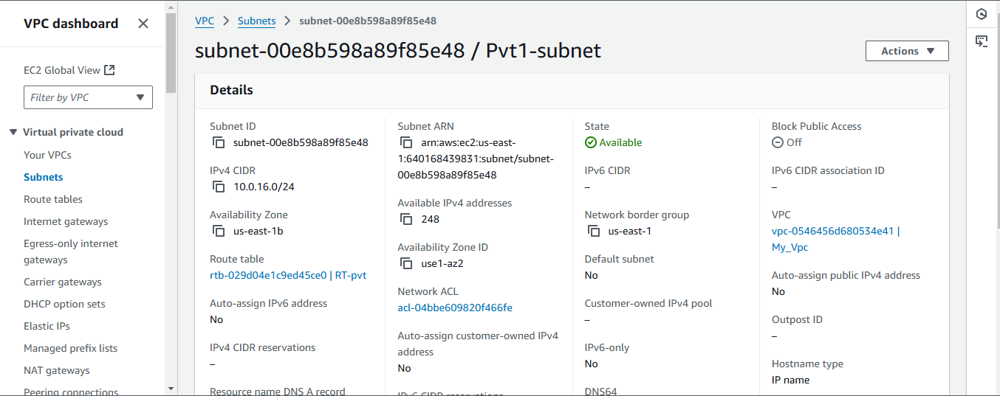

     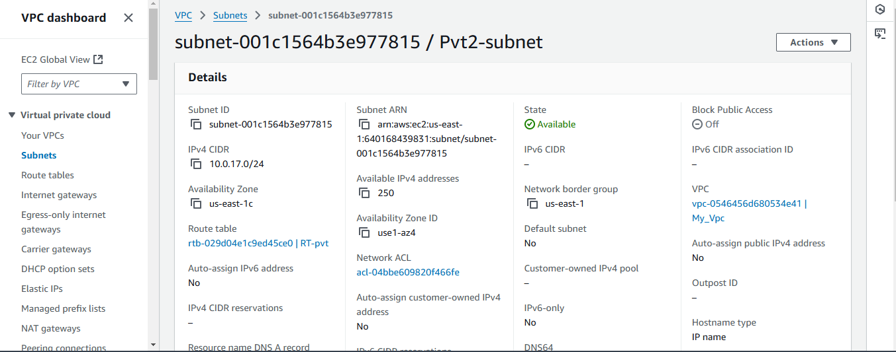

3) Create an Internet Gateway (IGW):

     Go to the Internet Gateways section of the VPC Dashboard.

     Click Create Internet Gateway and give it a name.

     Attach the Internet Gateway to your newly created VPC.

     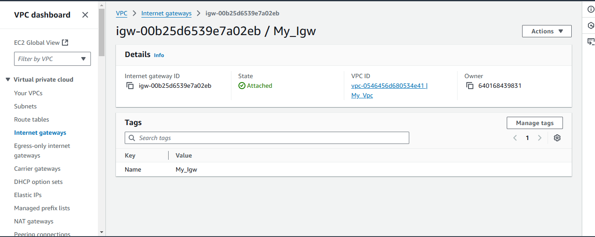

4) Route Table Configuration:

     Create a new route table for the public subnet and associate it with the public subnet.

     Add a route in the public route table:
     Destination: 0.0.0.0/0

     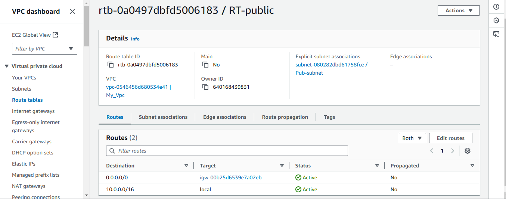

5)  Create EC2 Instances and Configure the       Application.

     Create one EC2 instances in public subnets:

     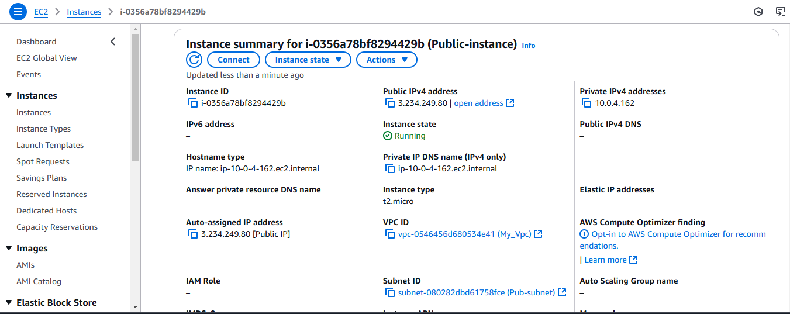

     Create 3 EC2 instances in the private subnet.

      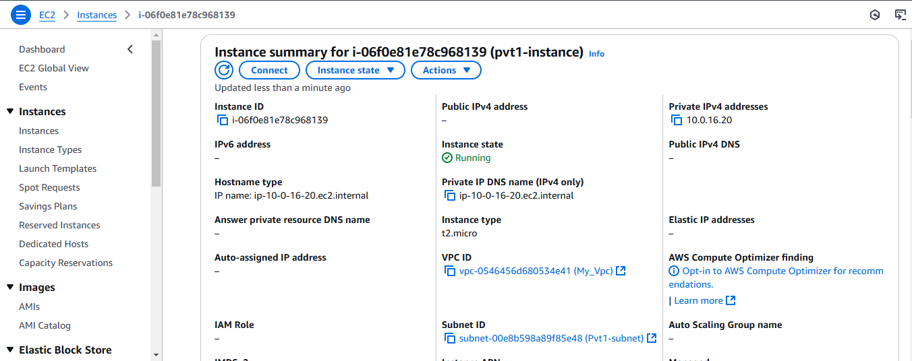

6)  Use an Amazon Linux for the instances.

     Make sure you select the private subnet for these instances and do not assign public IPs 
     
     
     Install the necessary software on EC2 instances:

     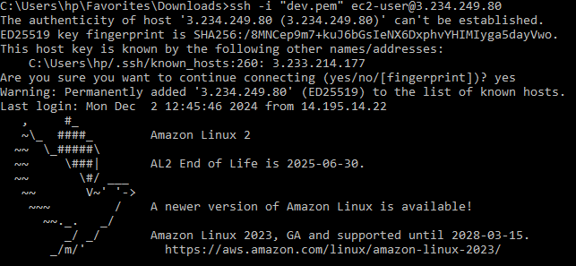

     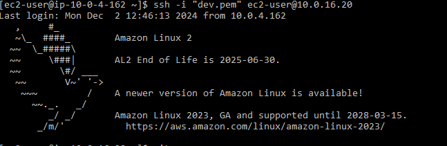

 7)  Install all the dependency softwares and     Deployed the Python application on EC2 instances.

       sudo yum update -y

       sudo yum install git python3 -y

       git clone https://github.com/NareshNarayanadasu/Job_Application.git

       cd Job_appliaction

       pip3 install -r requirements.txt

       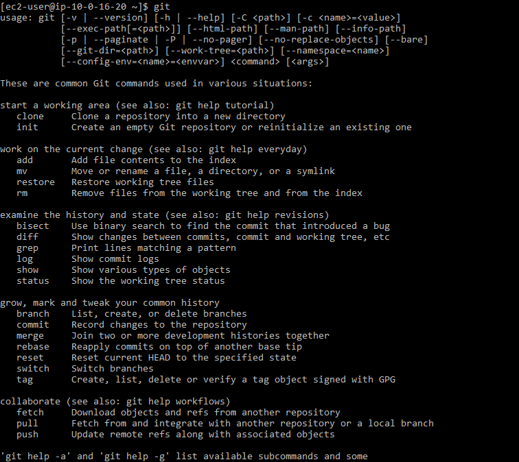

       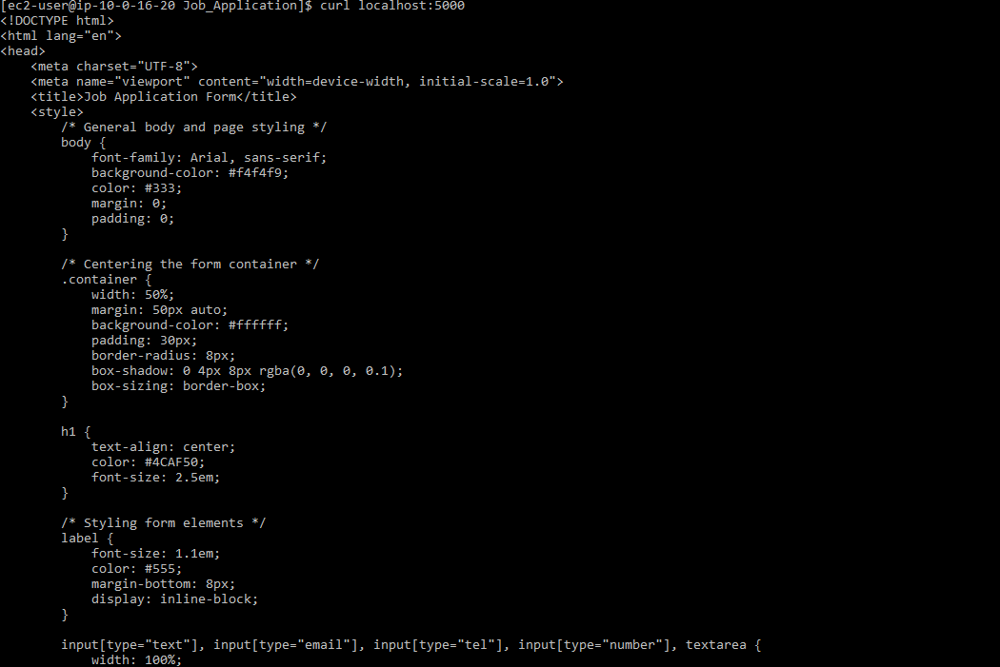

       

       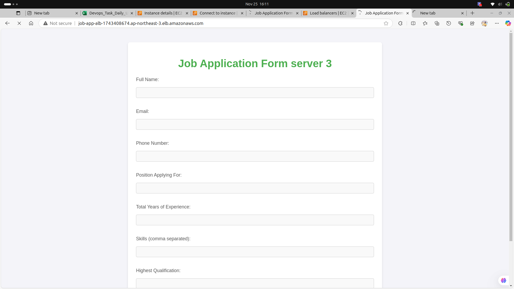

 8) Go to RDS Dashboard and click Create Database.

      Choose the database and create database.

      Set up the database in a private subnet (no public IP) and configure the security group to allow.

      Set up DB credentials (username, password) and select the storage options.

      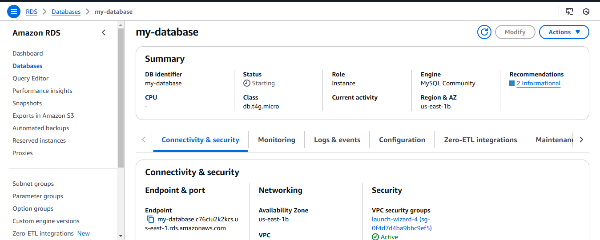

      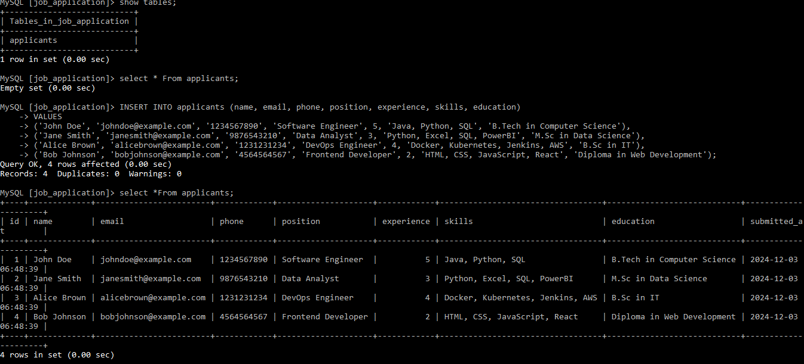

9)  Configure Load Balancer and Auto Scaling
    Set up an Application Load Balancer (ALB):

       Go to EC2 Dashboard and navigate to Load Balancers.

       Click Create Load Balancer and choose Application Load Balancer.

       Set the load balancer to be in the public subnet, allowing internet access.

       Ensure that the target group for the load balancer is set to your EC2 instances in the private subnet.

       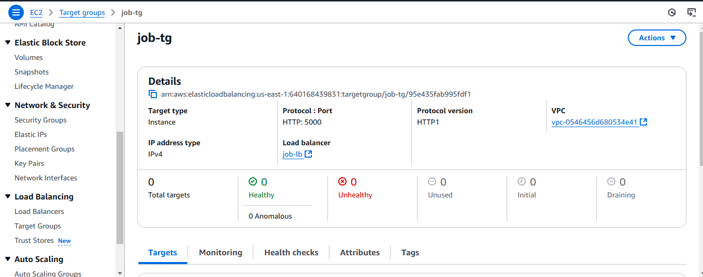

       The load balancer will distribute traffic to the EC2 instances.

       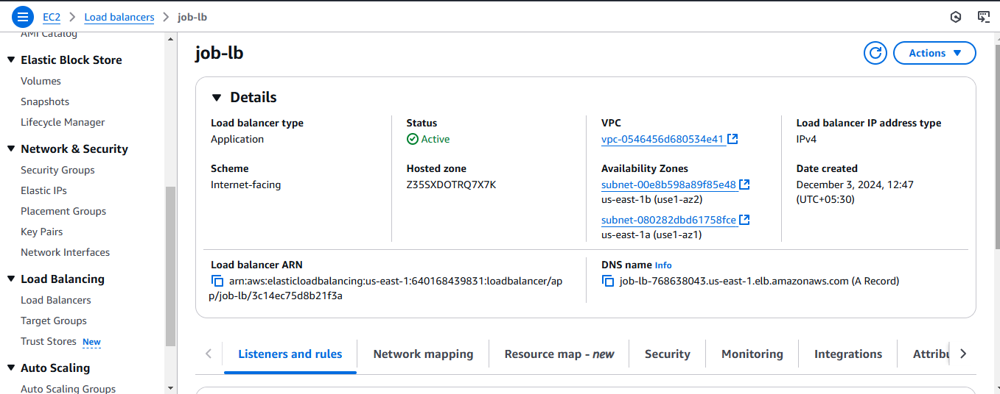

10) Create an Auto Scaling Group:

      Under the Auto Scaling section in EC2, create an Auto Scaling group.

      Set the desired number of instances to 3, with the minimum and maximum 

      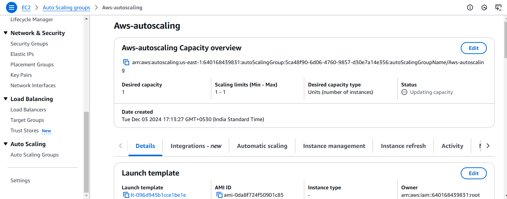

11) Monitoring and Notifications.

      Enabled CloudWatch Metrics

      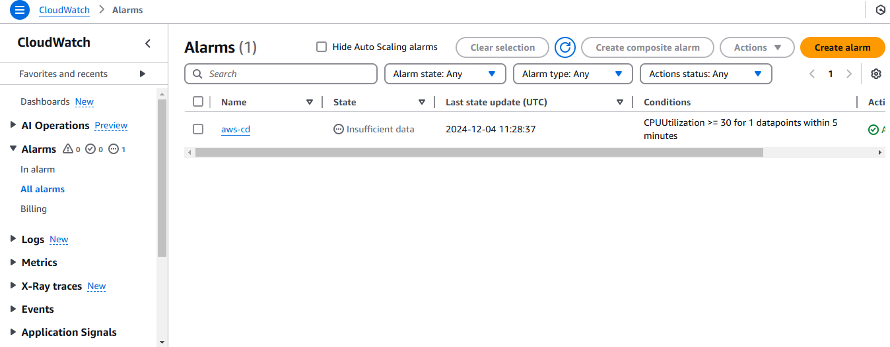

12. Set up Alarms and Notifications

     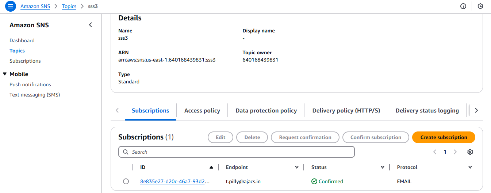

     
    I configured CloudWatch alarms for high CPU usage and integrated them with SNS to send email notifications. 

 13)  Step 13,14 and 15 

      I created Auto scaling but getting issue when running its not active because ec2 instance has exceeded the limit so i am unable to go for steps.      